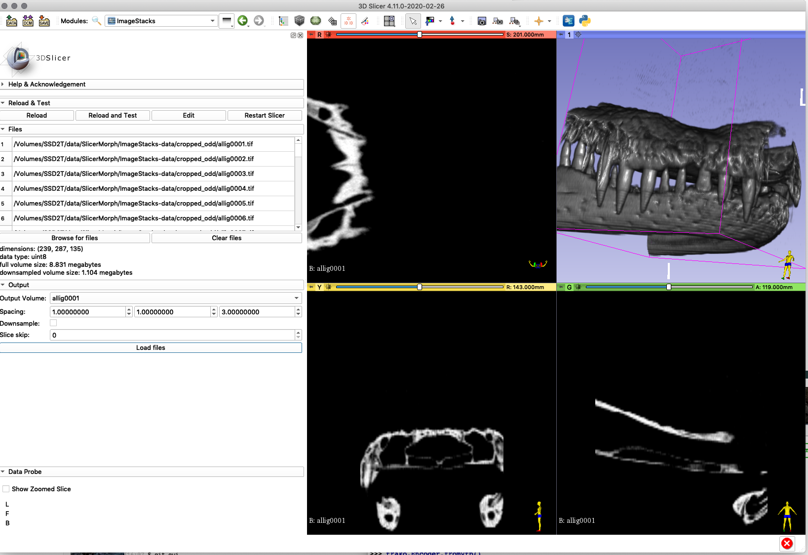

# SlicerImageStacks
Scripted utility to load image stacks (e.g. confocal microscopy) more easily.

## Basic usage
* use file browser to select list of images.
* enter spacing of original image data
* downsample uses 1/2 the pixels in each dimension (so volume is 1/8 size)
* skipping slices reduces the z-resolution



## Installation

For testing, paste this in the python console of a recent slicer nightly:

```
import os
import shutil

archiveFilePath = os.path.join(slicer.app.temporaryPath, "master.zip")
outputDir = os.path.join(slicer.app.temporaryPath, "SlicerImageStacks")

try:
    os.remove(archiveFilePath)
except FileNotFoundError:
    pass

try:
    shutil.rmtree(outputDir)
except FileNotFoundError:
    pass

os.mkdir(outputDir)

slicer.util.downloadAndExtractArchive(
    url = "https://github.com/pieper/SlicerImageStacks/archive/master.zip",
    archiveFilePath = archiveFilePath,
    outputDir = outputDir)

modulePath = os.path.join(outputDir, "SlicerImageStacks-master", "ImageStacks", "ImageStacks.py")
factoryManager = slicer.app.moduleManager().factoryManager()

factoryManager.registerModule(qt.QFileInfo(modulePath))

factoryManager.loadModules(["ImageStacks",])

slicer.util.selectModule("ImageStacks")

```
